# 🧠 Deep Generative Models: Visual Study Guide

  
  
<em>A comprehensive visual guide to understanding generative AI</em>

## 📋 Table of Contents

- [Introduction](#-introduction)
- [Key Applications](#-key-applications)
- [Core Concepts](#-core-concepts)
- [Types of Generative Models](#-types-of-generative-models)
  - [Autoregressive Models](#autoregressive-models)
  - [Variational Autoencoders (VAEs)](#variational-autoencoders-vaes)
  - [Normalizing Flows](#normalizing-flows)
  - [Generative Adversarial Networks (GANs)](#generative-adversarial-networks-gans)
  - [Energy-Based Models (EBMs)](#energy-based-models-ebms)
  - [Score-Based Models](#score-based-models)
  - [Diffusion Models](#diffusion-models)
- [Model Comparison](#-model-comparison)
- [Evaluation Methods](#-evaluation-methods)
- [The Curse of Dimensionality](#-the-curse-of-dimensionality)
- [Interview Preparation](#-interview-preparation)
  - [General Concepts](#general-concepts)
  - [Technical Details](#technical-details)
  - [Advanced Topics](#advanced-topics)

## 🌟 Introduction

  

Deep generative models (DGMs) are a cornerstone of modern artificial intelligence, addressing fundamental challenges in computer vision, natural language processing, and robotics. These models learn to understand complex, high-dimensional data by mapping signals (like images or speech) to useful representations for decision making.

At their core, generative models learn probability distributions from data, enabling them to generate new, previously unseen examples that maintain the characteristics of the training data. They represent a powerful set of techniques that allow AI systems to create content rather than just analyze it.

## 🚀 Key Applications

| Domain | Applications | Examples |
|--------|-------------|----------|
| 🖼️ **Computer Vision** | Image generation, super-resolution, inpainting | DALL-E, Stable Diffusion, Midjourney |
| 🏥 **Healthcare** | Medical image reconstruction, drug design | AlphaFold |
| 🔊 **Audio** | Speech synthesis, music generation, enhancement | AudioLM, MusicLM |
| 💬 **Natural Language** | Text generation, translation, summarization | GPT, LLaMA |
| 💻 **Programming** | Code completion, bug detection | GitHub Copilot |
| 🤖 **Robotics** | Motion planning, task learning | RT-1, RT-2 |

### Visual Examples of Generated Content

  <table>
    <tr>
      <td></td>
      <td></td>
      <td></td>
    </tr>
    <tr>
      <td>
Text-to-Image
</td>
      <td>
Super-Resolution
</td>
      <td>
Image Inpainting
</td>
    </tr>
  </table>

## 🧩 Core Concepts

- **📊 Representation**: Methods for encoding complex data into manageable forms
- **🧮 Statistical Modeling**: Mathematical frameworks for describing data
- **📈 Probability Distributions**: Patterns of how values occur within datasets
- **📉 Loss Functions**: Methods to compare data and model distributions, guiding model adaptation
- **🎲 Sampling Techniques**: Approaches for efficiently drawing examples from complex distributions

## 🔄 Types of Generative Models

### Autoregressive Models

```mermaid
flowchart LR
    A["Input Sequence"] --> B["x₁"]
    A --> C["x₂"]
    A --> D["x₃"]
    A --> E["..."]
    A --> F["xₙ"]
    B --> G["P(x₁)"]
    B --> H["P(x₂|x₁)"]
    C --> H
    B --> I["P(x₃|x₁,x₂)"]
    C --> I
    D --> I
```

  

  <h4>Joint Probability</h4>
  
<em>P(x₁,x₂,...,xₙ) = P(x₁) × P(x₂|x₁) × ... × P(xₙ|x₁,...,xₙ₋₁)</em>

**Key Characteristics:**
- Break down joint probability distributions into products of conditional probabilities
- Employ the chain rule to simplify complex distribution modeling
- Computationally efficient
- Effective at unsupervised latent feature discovery

**Implementations:**
- Recurrent Neural Networks (RNNs)
- Transformer-based models (like GPT)
- PixelRNN/PixelCNN for images

**Challenges:**
- RNNs can be slow to train
- May struggle with long-term dependencies
- Difficulty learning sequence order

### Variational Autoencoders (VAEs)

```mermaid
flowchart LR
    A["Input x"] --> B["Encoder"]
    B --> C["Latent Space z"]
    C --> D["Decoder"]
    D --> E["Reconstructed x'"]
    B --> F["Mean μ"]
    B --> G["Variance σ²"]
    F --> H["Sampling"]
    G --> H
    H --> C
```

  

  <h4>Loss Function</h4>
  
<em>L = Reconstruction Loss + KL Divergence</em>

**Key Characteristics:**
- Use two neural networks: encoder and decoder
- Create a compressed representation in latent space
- Learn probability distributions rather than fixed encodings
- Enable generation by sampling from latent space

**Components:**
- **Encoder**: Maps input data to latent representation (typically Gaussian)
- **Decoder**: Reconstructs original data from latent variables
- **ELBO Loss**: Balances reconstruction quality with latent space regularization

**Applications:**
- Image generation
- Data compression
- Anomaly detection

### Normalizing Flows

```mermaid
flowchart LR
    A["Simple Distribution"] --> B["Transform f₁"]
    B --> C["Transform f₂"]
    C --> D["..."]
    D --> E["Transform fₙ"]
    E --> F["Complex Distribution"]
```

  

  <h4>Mathematical Foundation</h4>
  
<em>p_x(x) = p_z(f⁻¹(x)) |det J_f⁻¹(x)|</em>

  

**Key Characteristics:**
- Transform simple distributions into complex ones through invertible functions
- Maintain exact likelihood computation
- Allow efficient sampling and inference
- Require same dimensions for input and output spaces
- Include chained layers that can effectively change probability density

**Mathematical Requirements:**
- Transformations must be invertible
- Jacobian determinant must be set to one, meaning you don't expand or contract the volume of a hypercube, just move it
- x and z must have the same dimension
- Must find an efficient way to reverse the transformation

**Implementation Approaches:**
- Additive Coupling Layer: A simple type of invertible transformation used in normalizing flows
- Various neural network architectures or layers that achieve the required properties
- The model enables transformation of simpler distributions into more complex shapes by combining these layers

**Types:**
- Coupling flows (e.g., RealNVP)
- Autoregressive flows
- Residual flows

### Generative Adversarial Networks (GANs)

  

**Key Characteristics:**
- Two-network architecture: generator and discriminator in competition
- Generator creates data to fool discriminator
- Discriminator differentiates real from generated data
- Operates as a minimax game framework
- Implicit density modeling (no explicit probability computation)
- Freedom from likelihood calculations, using only samples for evaluation

**Theoretical Framework:**
- Optimizes a broad class of divergences between data and model distributions
- F-divergences: Generalizes beyond Jensen-Shannon divergence
- V-Stein distance: Can be expressed as solution to an optimization problem
- Bayesian GAN: Aims to obtain latent representations by altering the learning objective

**Variants:**
- DC-GAN
- Style-GAN
- CycleGAN
- BigGAN

**Challenges:**
- Training instability
- Mode collapse
- Difficult evaluation

### Energy-Based Models (EBMs)

```mermaid
flowchart LR
    A["Input x"] --> B["Energy Function E(x)"]
    B --> C["Unnormalized Probability"]
    B --> H["Partition Function Z(θ)"]
    C --> I["Normalized Probability"]
    H --> I
    D["Low Energy"] --> E["High Probability"]
    F["High Energy"] --> G["Low Probability"]
```

  

**Key Characteristics:**
- Define probability distributions through energy functions
- Assign low energy to likely data points and high energy to unlikely ones
- Extremely flexible modeling approach
- Allow for combining different types of generative models
- Create probability models by defining an unnormalized probability density function and normalizing it with a partition function

**Mathematical Foundation:**
- Partition Function (Z(θ)): Normalization constant used to divide an unnormalized probability function to obtain a valid probability model
- The core idea: Given a non-negative function G(θ), a valid probability model can be defined by dividing by the total volume/area (the integral of the unnormalized probability over all possible inputs)

**Challenges:**
- Difficult partition function evaluation
- Computationally intensive sampling (often using MCMC)
- Training stability issues

**Applications:**
- Image generation
- Anomaly detection
- Structure prediction

### Score-Based Models

  

**Key Characteristics:**
- Model the gradient of log probability (score) instead of density
- Use vector fields to represent data distributions
- Leverage score matching for training
- Employ Langevin dynamics for sampling

**Score Matching Techniques:**
- Direct score estimation can be challenging in high dimensions
- Noise addition approach: Estimating the score of noisy data distribution is more scalable
- Fisher Divergence: Training involves minimizing the Fisher Divergence between model and noisy data distributions
- Denoising approach: Reduces to noise cleaning but estimates the score of noisy data distribution rather than clean data

**Sampling with Langevin Dynamics:**
- After learning the score, samples can be generated using Langevin Dynamics
- Implements a noisy gradient ascent procedure that moves toward high-probability regions
- Starts a particle somewhere, adds noise at each step, and attempts to move toward high-probability regions

**Connection to Diffusion Models:**
- DDPM (Denoising Diffusion Probabilistic Models) and score-based models differ in the numerical methods used to solve SDEs
- DDPM uses a prediction algorithm while score-based models use correction algorithms

**Advantages:**
- More computationally convenient than direct density modeling
- Strong connection to diffusion models
- State-of-the-art performance on various continuous data types

### Diffusion Models

```mermaid
flowchart TD
    A["Original Data x₀"] --> B["Add Noise Step 1"]
    B --> C["Add Noise Step 2"]
    C --> D["..."]
    D --> E["Pure Noise xₙ"]
    E --> F["Denoise Step n"]
    F --> G["Denoise Step n-1"]
    G --> H["..."]
    H --> I["Reconstructed Data x₀"]
    J["Forward Process"] --> A
    J --> E
    K["Reverse Process"] --> E
    K --> I
```

  

  <h4>VAE Connection</h4>
  

**Key Characteristics:**
- Progressive transformation between data and noise
- Forward process: gradually add noise to data (typically Gaussian noise)
- Reverse process: learn to remove noise step by step
- Use neural networks to model the reverse process

**Theoretical Connections:**
- VAE Framework: Diffusion models can be viewed as a variational autoencoder where the encoder adds noise (forward process) and the decoder cleans noise (reverse process)
- Continuous Time Diffusion: Considering a continuous spectrum of noise levels instead of a finite number for more efficient sampling and probability evaluation

**Components:**
- Noise schedule: determines rate of noise addition
- Score function: guides denoising process
- Sampling procedure: typically uses multiple steps

**Extensions for Discrete Data:**
- Challenges: Interpolation isn't meaningful in discrete data spaces
- Concrete Score: Generalizing continuous score functions to discrete spaces using finite differences
- Denoising Score Entropy Loss: Special loss function for training score functions for discrete data
- Reverse Diffusion Matrix: Formulated to define the reverse diffusion process for discrete data

**State-of-the-art Applications:**
- Text-to-image generation (DALL-E, Stable Diffusion)
- High-quality image synthesis
- Audio generation

## 📊 Model Comparison

| Model Type | Explicit Density | Training Stability | Sample Quality | Sample Speed | Mode Coverage |
|------------|:----------------:|:------------------:|:--------------:|:------------:|:-------------:|
| Autoregressive | ✅ | ⭐⭐⭐⭐ | ⭐⭐⭐ | ⭐⭐ | ⭐⭐⭐⭐ |
| VAE | ✅ (lower bound) | ⭐⭐⭐⭐ | ⭐⭐⭐ | ⭐⭐⭐⭐⭐ | ⭐⭐⭐⭐ |
| Normalizing Flows | ✅ | ⭐⭐⭐ | ⭐⭐⭐ | ⭐⭐⭐⭐ | ⭐⭐⭐ |
| GANs | ❌ | ⭐⭐ | ⭐⭐⭐⭐⭐ | ⭐⭐⭐⭐⭐ | ⭐⭐ |
| EBMs | ✅ (up to Z) | ⭐⭐ | ⭐⭐⭐ | ⭐ | ⭐⭐⭐ |
| Score-Based | ✅ (indirectly) | ⭐⭐⭐ | ⭐⭐⭐⭐ | ⭐⭐ | ⭐⭐⭐⭐ |
| Diffusion | ✅ (indirectly) | ⭐⭐⭐⭐⭐ | ⭐⭐⭐⭐⭐ | ⭐⭐ | ⭐⭐⭐⭐⭐ |

## 📏 Evaluation Methods

  

Evaluating generative models is challenging with no consensus on the "right" approach. Common metrics include:

### Visual Quality Metrics
- **Inception Score (IS)**: Measures quality and diversity of generated images
- **Fréchet Inception Distance (FID)**: Compares feature distributions between real and generated images
- **Kernel Inception Distance (KID)**: Similar to FID but uses a kernel to compare similarities with a more principled approach
- **Kernel Maximum Mean Discrepancy (MMD)**: Measures statistical distance between distributions

### Density Estimation
- **Kernel Density Estimation (KDE)**: Allows approximation of the underlying probability density function when only samples are available from a model that can't directly evaluate probability

### Domain-Specific Evaluation
- **Text-to-image**: Image quality, text alignment, bias, reasoning, and toxic content
- **Natural Language**: Perplexity, BLEU, ROUGE, human evaluation
- **Unsupervised Learning**: Clustering quality, compression efficiency

### Multi-faceted Assessment
- For models like text-to-image systems, a comprehensive evaluation must consider multiple factors beyond just image quality
- Human evaluation remains crucial for many aspects that are difficult to quantify algorithmically

## 🧮 The Curse of Dimensionality

The curse of dimensionality is a fundamental challenge in generative modeling:

- As dimensionality increases, the space becomes exponentially sparser
- Points become equidistant in high dimensions
- Probability distributions become harder to represent and model
- Deep learning helps overcome these challenges through learned representations

## 🎓 Interview Preparation

### General Concepts

<b>What are diffusion models and why are they important?</b>

Diffusion models are generative models that progressively transform data into noise and learn to reverse this process. Their importance stems from their ability to generate high-quality samples across various domains including images, audio, and text, making them fundamental to recent advances in generative AI.

<b>Explain the basic principles of diffusion models</b>

Diffusion models operate on a two-step process:

1. **Forward Diffusion**: Gradually adding noise to data, corrupting its structure
2. **Reverse Diffusion**: Learning to reverse the noise to reconstruct the original structure

This approach can be likened to a variational autoencoder where the encoder (forward diffusion) adds noise, and the decoder (reverse diffusion) removes it.

<b>What are the key differences between diffusion models and other generative models?</b>

- Unlike GANs, diffusion models don't require adversarial training, leading to more stable optimization
- Unlike VAEs, diffusion models can generate higher-quality samples at the cost of slower sampling
- Unlike autoregressive models, diffusion models can generate data in parallel rather than sequentially
- Compared to normalizing flows, diffusion models have greater flexibility but less efficient likelihood computation

### Technical Details

<b>What is a score function and how is it used in diffusion models?</b>

A score function is the gradient of the log probability density (∇x log p(x)). In diffusion models, score functions guide the denoising process by indicating the direction of increasing probability density. The neural network is trained to estimate these score functions at different noise levels, enabling the gradual reversal of the diffusion process during sampling.

<b>Explain noise schedules in diffusion models</b>

A noise schedule determines how noise is added during the forward diffusion process. It typically involves increasing variance of Gaussian noise over time. The optimal noise schedule balances:

- Complete destruction of data structure at the final step
- Gradual enough progression to allow learning the reverse process
- Computational efficiency during training and sampling

Various strategies can be employed to find an ideal noise schedule, including learning it as part of the model.

<b>What is Langevin dynamics and how does it relate to diffusion models?</b>

Langevin dynamics is a sampling method that uses noisy gradient ascent steps to move toward regions of higher probability. In diffusion models, Langevin dynamics provides the theoretical foundation for the reverse diffusion process, where the estimated score function guides the denoising steps. The stochastic nature of Langevin dynamics helps exploration of the probability space and prevents the model from getting stuck in local maxima.

### Advanced Topics

<b>How can diffusion models be made more efficient?</b>

Several approaches can improve diffusion model efficiency:

1. **Progressive Distillation**: Training smaller models to match larger ones with fewer steps
2. **Consistency Models**: Aiming for direct one-step generation
3. **Improved Samplers**: Using advanced numerical schemes for SDE solutions
4. **Learned Noise Schedules**: Optimizing the noise addition/removal process
5. **Knowledge Distillation**: Transferring knowledge from larger to smaller models

<b>How are diffusion models controlled for specific generation tasks?</b>

Diffusion models can be controlled through several methods:

1. **Classifier Guidance**: Using gradients from a classifier to steer generation
2. **Classifier-Free Guidance**: Training conditional models to respond to guidance strength parameters
3. **Textual Conditioning**: Using text embeddings to guide generation (text-to-image)
4. **Cross-Attention Mechanisms**: Allowing text features to influence the denoising process
5. **ControlNet**: Adding specialized control inputs for specific attributes

<b>How are diffusion models applied to inverse problems?</b>

Inverse problems involve recovering full information from partial observations. Diffusion models address these by:

1. Conditioning the reverse process on available measurements
2. Adding measurement consistency terms during sampling
3. Using modified score functions that respect measurement constraints
4. Leveraging pre-trained diffusion models as priors for ill-posed problems

Examples include super-resolution, inpainting, and medical image reconstruction.

---

  
<strong>🔍 Further Resources</strong>

  

    <a href="#" target="_blank">Stanford's HELM Project</a> •
    <a href="#" target="_blank">Google's BigBench</a> •
    <a href="#" target="_blank">Official PyTorch Implementations</a>
  

